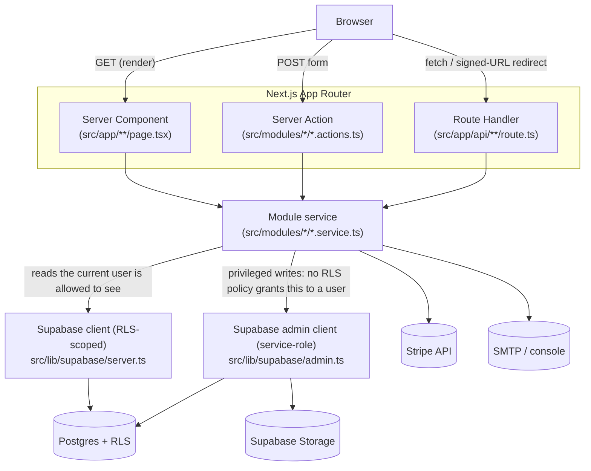
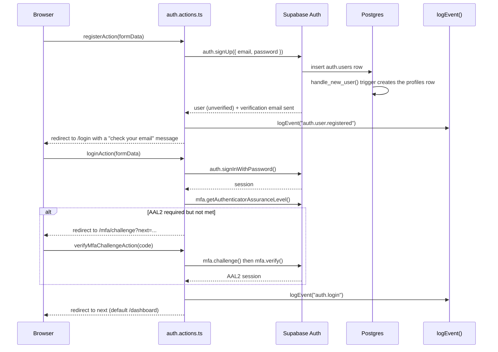
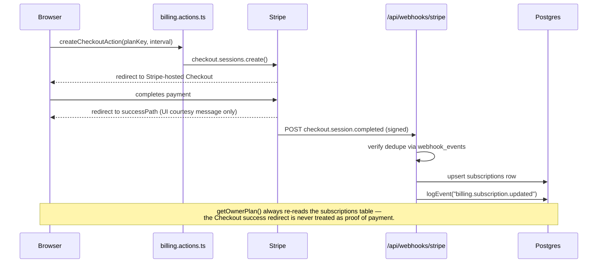

# Architecture

This is the "how does a request actually move through this app" doc. For the database itself, see
[DATABASE.md](DATABASE.md). For what each module does and how to extend it, see
[MODULES.md](MODULES.md). For the security model, see [SECURITY.md](SECURITY.md).

The boilerplate uses a feature-oriented Next.js App Router architecture. Server Components are the
default rendering model; Client Components are reserved for interactive UI (there are almost none
in this codebase — most interactivity is plain HTML forms posting to Server Actions). There is no
separate API layer: Server Actions and Route Handlers *are* the API.

## Directory model

```
src/app/        Routes, layouts, route handlers — the only place UI meets the URL.
src/modules/    Feature modules: service.ts (data access + business rules), actions.ts
                (Server Actions — thin wrappers: auth check, parse input, call the service,
                redirect), *.schemas.ts (Zod validation).
src/config/     Typed, static configuration. No I/O, no Supabase calls — safe to import
                anywhere, including at module load time.
src/lib/        Framework-agnostic infrastructure with zero business logic: Supabase client
                factories, the email/event/pagination/error primitives other modules build on.
src/components/ Shared UI — forms, buttons, layout chrome. No business logic.
src/emails/     React Email templates.
src/types/      Hand-maintained Supabase schema types.
supabase/       SQL migrations — the schema, indexes, functions, triggers, and RLS policies.
e2e/            Playwright specs, one file per module.
```

A module's internal split is deliberate and consistent across all nine of them (`auth`,
`organizations`, `email`, `billing`, `notifications`, `files`, `admin`, `users`): **`service.ts`
never imports `next/navigation` or reads `FormData`, and `actions.ts` never constructs a Supabase
query directly.** A service function is a plain async function you could call from a script, a
cron job, or another module — an action is a thin adapter between a `<form>` and that function.

## Dependency direction

UI (`src/app/**`) imports from `src/modules/**` and `src/components/**`. Modules import from
`src/lib/**` and `src/config/**`, and — sparingly, only where a real cross-module need
exists — from each other's `service.ts` (e.g. `src/modules/files/files.service.ts` imports
`can()` from `src/modules/auth/authorization.ts`; `src/modules/admin/*.service.ts` imports
`logEvent` from `src/lib/events/`). `src/lib/**` and `src/config/**` never import from
`src/modules/**` or `src/app/**` — infrastructure doesn't know about features built on top of it.
This is what lets `src/lib/events/`, for instance, be called from `auth`, `organizations`,
`billing`, `files`, and `admin` without any of those creating a dependency on each other.

## Request flow

Every request follows one of three paths, all converging on the same module `service.ts`:



**Which Supabase client a service uses is not a style choice — it's the security boundary.**
Reads and writes a user is allowed to do themselves (read their own files, mark their own
notification read) go through the RLS-scoped client from `src/lib/supabase/server.ts`, and RLS
enforces the boundary. Writes nothing should ever let a client-side call perform directly —
creating a notification, minting a signed URL, adjusting a credit ledger, suspending a user — go
through the service-role admin client from `src/lib/supabase/admin.ts`, called only from server
code that has already done its own authorization check. See
[SECURITY.md](SECURITY.md#service-role) for the exact rule.

## Auth flow



`requireUser()` (`src/modules/auth/session.ts`) is the single choke point every protected
Server Component and Server Action calls: it resolves the session, redirects guests to `/login`,
and redirects suspended users back to `/login` with an error — so "is this user allowed to be
here at all" is answered in exactly one place, not re-implemented per route.

## Billing flow



**Stripe — via the webhook, never the Checkout success redirect — is the source of truth for
subscription state.** A user landing on the success page before the webhook has been processed
sees a "processing" message, not an immediately-unlocked plan; `getOwnerPlan()`
(`src/modules/billing/billing.service.ts`) is what every entitlement check
(`requireSubscription`, `hasFeature`, `getLimit`) ultimately calls, and it only ever reads the
database.

## Domain boundaries

- **A module owns its own tables.** `organizations.service.ts` is the only code that writes
  `organizations`/`organization_members`/`organization_invitations` directly; `billing.service.ts`
  and `credits.service.ts` own the billing tables. Cross-module reads happen through the other
  module's exported service function, not a raw query against its table.
- **Feature flags gate at the boundary, not inside business logic.** `requireFeature("files")`
  (or `isFeatureEnabled("files")` for a conditional render) is called at the top of an action or
  page — the service functions underneath assume the feature is on. The one deliberate exception
  is `createNotification`, which no-ops internally when `features.notifications` is off, so every
  *producer* (a dozen call sites across other modules) doesn't have to remember to check first.
- **`src/lib/events/` has no dependency on `src/modules/admin/`**, even though the admin module is
  its biggest consumer — the write side (`logEvent()`) is generic infrastructure any module can
  call; only the *read* side (`listAuditLogs`, for the `/admin/audit-log` page) lives in the admin
  module.

## Key architectural decisions

### Owner-polymorphic billing

A product either bills individual users, or bills the organization on behalf of all its members —
never both, and never configured independently of whether organizations are enabled at all.
`billingOwnerType` (`src/config/billing.ts`) is *derived* from `featureConfig.organizations`, not
an independent setting, and `resolveBillingOwner()`/`requireBillingOwner()`
(`src/modules/billing/owner.ts`) are the only place that derivation happens — every billing,
usage, and credit function downstream takes an already-resolved `BillingOwner` and never branches
on the feature flag itself. This is why `stripe_customers`, `subscriptions`, `credit_transactions`,
and `usage_counters` all share the same `owner_type` + nullable `user_id`/`organization_id` shape
(see [DATABASE.md](DATABASE.md)) — one schema shape, one service layer, two products.

### RLS-first security

Row Level Security is the primary authorization boundary, not an afterthought layered on top of
application checks. Role-based checks in action files (`requireOrgRole` in
`organizations.actions.ts`, `can()` in `authorization.ts`) exist for fast, clear error messages —
if a future caller bypassed them entirely, RLS still holds. Tables with no legitimate user-facing
write path (`stripe_customers`, `subscriptions`, `notifications`, `audit_logs`,
`tenant_paperless_config`, `paperless_object_map`, ...) simply have no insert/update RLS policy
at all, so the *only* way to write to them is the service-role admin client from trusted server
code. See [SECURITY.md](SECURITY.md) for the full rule set.

### Provider abstractions

Two pieces of infrastructure are built behind a small interface specifically so the underlying
service can be swapped without touching any caller: `EmailProvider`
(`src/lib/email/types.ts` — `ConsoleEmailProvider`/`SmtpEmailProvider` are the two
implementations) and the Storage/file-validation layer (`src/lib/files/validate.ts`,
independent of which bucket or CDN sits behind Supabase Storage). Neither `email.service.ts` nor
any of its callers know which provider is active.

### The event/audit dispatcher

`logEvent()` (`src/lib/events/`) fans one event out to a list of `EventSink`s — today `consoleSink`
and `auditLogSink` — rather than every module hand-rolling its own "write to console and also to
the database" logic. Adding a new destination (Slack, analytics) is writing one more `EventSink`
and adding it to the list; no existing call site changes. **One deliberate exception**:
organization permission-change mutations (`update_member_role`, `remove_member`,
`leave_organization`, `transfer_organization_ownership` — Pomočnik, ADR-0008) bypass this
dispatcher entirely and write their audit row transactionally inside the same Postgres function
as the mutation, precisely because `logEvent()`'s sinks are deliberately best-effort and never
throw back into the caller — the right behavior for supplementary logging, the wrong one for a
mutation that needs a guaranteed audit record. See
[MODULES.md#audit-logs](MODULES.md#audit-logs).

### Job retries as a queue-wide default, not per-job

Every BullMQ queue (`src/lib/queue/index.ts`) gets the same `defaultJobOptions` — 3 attempts,
exponential backoff — rather than each of the ~13 job handlers configuring (or forgetting to
configure) its own. This was a real, live-found gap, not a preemptive decision: no queue had any
retry policy at all until this session, so a single transient failure (e.g. one dropped
connection to Paperless) permanently failed a job despite that job's own resumability design
(checkpointing via a persisted task id, conditional claims) already assuming a retry would
happen. Enabling retries then surfaced a second bug — a same-job retry landing after a claim
could never reclaim its own row — fixed by widening the claim conditions and by only writing a
terminal `failed` status on a job's *last* attempt (`worker/context.ts`'s `isLastAttempt()`), not
every attempt.

### Cursor-based pagination

Every paginated list in the app (notifications, files, admin users/organizations/audit log) uses
the same `encodeCursor`/`decodeCursor` pair (`src/lib/pagination.ts`) over `(created_at, id)`
rather than offset/limit — stable under concurrent inserts and doesn't degrade on large tables the
way `OFFSET` does. One generic implementation, reused rather than reinvented per list.

### Feature-flagged, not conditionally-compiled

`src/config/features.ts` flags are read at runtime, not build time — there's no separate build per
module combination. A disabled module's routes still exist and still call `requireFeature()`,
which throws; its nav entries just don't render. This keeps the codebase a single deployable
artifact regardless of which modules a given product turns on.
