# Database

This is the full schema reference: every table, column, enum, function, and Storage bucket, plus
the migration history that produced them. For *why* a table or policy is shaped the way it is,
see [SECURITY.md](SECURITY.md) and the relevant section of [MODULES.md](MODULES.md) — this doc is
the "what exists" reference, not the "why" narrative.

All tables live in the `public` schema. `auth.users` is Supabase-managed and not listed as its own
entity below — `public.profiles.id` is a 1:1 foreign key to it (`on delete cascade`), and every
`user_id`/`owner_id`/`actor_id`/`created_by`/`invited_by`/`accepted_by` column elsewhere also
references `auth.users(id)` directly (not `profiles.id`), which is why the diagram below draws
those relationships from `PROFILES` — they're the same row.

## Entity-relationship diagram

```mermaid
erDiagram
  PROFILES {
    uuid id PK "= auth.users.id"
    text email
    text name
    text avatar_url
    text timezone "default 'UTC'"
    text locale "default 'en'"
    boolean onboarding_completed
    boolean is_app_admin
    timestamptz suspended_at
    timestamptz created_at
    timestamptz updated_at
  }

  ORGANIZATIONS {
    uuid id PK
    text name
    text slug UK
    text logo_url
    uuid created_by FK "auth.users, set null"
    timestamptz suspended_at
    text timezone "default 'Europe/Ljubljana' — Pomočnik"
    text locale "default 'sl-SI' — Pomočnik"
    char currency "default_currency, default 'EUR' — Pomočnik"
    text provisioning_status "pending|provisioning|ready|provisioning_failed, system-managed — Pomočnik"
    boolean ai_enabled "default false, system-managed — Pomočnik"
    timestamptz created_at
    timestamptz updated_at
  }

  ORGANIZATION_MEMBERS {
    uuid id PK
    uuid organization_id FK
    uuid user_id FK "auth.users"
    organization_role role "owner | admin | member | read-only"
    timestamptz created_at
    timestamptz updated_at
  }

  ORGANIZATION_INVITATIONS {
    uuid id PK
    uuid organization_id FK
    text email
    organization_role role
    text token_hash UK
    uuid invited_by FK "auth.users, set null"
    uuid accepted_by FK "auth.users, set null"
    timestamptz accepted_at
    timestamptz revoked_at
    timestamptz expires_at
    timestamptz created_at
    timestamptz updated_at
  }

  STRIPE_CUSTOMERS {
    uuid id PK
    billing_owner_type owner_type "user | organization"
    uuid user_id FK "auth.users, nullable"
    uuid organization_id FK "nullable"
    text stripe_customer_id UK
    timestamptz created_at
    timestamptz updated_at
  }

  SUBSCRIPTIONS {
    uuid id PK
    billing_owner_type owner_type
    uuid user_id FK "auth.users, nullable"
    uuid organization_id FK "nullable"
    text stripe_customer_id
    text stripe_subscription_id UK
    text stripe_price_id
    text plan_key
    subscription_status status
    timestamptz current_period_start
    timestamptz current_period_end
    boolean cancel_at_period_end
    timestamptz platform_disabled_at "admin override, never set by Stripe"
    timestamptz created_at
    timestamptz updated_at
  }

  CREDIT_TRANSACTIONS {
    uuid id PK
    billing_owner_type owner_type
    uuid user_id FK "auth.users, nullable"
    uuid organization_id FK "nullable"
    integer amount "not 0; ledger entry, never mutated"
    credit_transaction_type type
    text reference
    jsonb metadata
    uuid created_by FK "auth.users, set null"
    timestamptz created_at
  }

  USAGE_COUNTERS {
    uuid id PK
    billing_owner_type owner_type
    uuid user_id FK "auth.users, nullable"
    uuid organization_id FK "nullable"
    text feature
    text period "'lifetime' | YYYY-MM-DD | YYYY-MM"
    integer quantity
    timestamptz reset_at
    timestamptz created_at
    timestamptz updated_at
  }

  NOTIFICATIONS {
    uuid id PK
    uuid user_id FK "auth.users"
    text type
    text title
    text message
    jsonb metadata
    timestamptz read_at
    timestamptz created_at
  }

  FILES {
    uuid id PK
    uuid owner_id FK "auth.users"
    uuid organization_id FK "nullable"
    text bucket
    text path
    text filename
    text mime_type
    bigint size "> 0"
    jsonb metadata
    timestamptz created_at
  }

  AUDIT_LOGS {
    uuid id PK
    uuid actor_id FK "auth.users, set null, nullable = system-initiated"
    text actor_type "user|system|rule|import|ai, default 'user' — ADR-0005, Pomočnik"
    uuid organization_id FK "set null, nullable"
    text action "dot-namespaced, e.g. auth.login"
    text entity_type
    text entity_id
    jsonb metadata
    inet ip_address
    text user_agent
    timestamptz created_at
  }

  WEBHOOK_EVENTS {
    uuid id PK
    text provider "e.g. 'stripe'"
    text event_id
    text event_type
    webhook_processing_status status
    jsonb payload
    text error
    timestamptz processed_at
    timestamptz created_at
    timestamptz updated_at
  }

  PROJECTS {
    uuid id PK
    uuid owner_id FK "auth.users"
    uuid organization_id FK "nullable"
    text name
    text description
    timestamptz created_at
    timestamptz updated_at
  }

  TENANT_PAPERLESS_CONFIG {
    uuid organization_id PK "= organizations.id"
    text base_url
    int service_user_id "Paperless-side user id"
    int group_id "Paperless-side group id"
    bytea api_token_encrypted "AES-GCM, admin-client only, never in a client response"
    int storage_path_id "nullable"
    timestamptz last_reconciled_at
    timestamptz created_at
    timestamptz updated_at
  }

  PAPERLESS_OBJECT_MAP {
    bigint id PK
    uuid organization_id FK
    text object_type "document|tag|document_type|custom_field|correspondent|storage_path|workflow|saved_view"
    int paperless_id "unique together with object_type, without organization_id — deliberate"
    uuid local_id "nullable — our row, where one exists"
    timestamptz created_at
  }

  ENTITY_TYPES {
    uuid id PK
    uuid organization_id FK
    text key "e.g. 'customer' — unique with organization_id"
    text name
    text name_plural
    text icon "nullable"
    boolean is_system "true for the 4 seeded types"
    jsonb field_schema
    timestamptz created_at
    timestamptz updated_at
  }

  PROFILES ||--o{ ORGANIZATION_MEMBERS : "is a member via"
  ORGANIZATIONS ||--o{ ENTITY_TYPES : "has (Pomočnik)"
  ORGANIZATIONS ||--|| TENANT_PAPERLESS_CONFIG : "has (Pomočnik)"
  ORGANIZATIONS ||--o{ PAPERLESS_OBJECT_MAP : "owns (Pomočnik)"
  ORGANIZATIONS ||--o{ ORGANIZATION_MEMBERS : "has"
  ORGANIZATIONS ||--o{ ORGANIZATION_INVITATIONS : "has"
  PROFILES ||--o{ ORGANIZATION_INVITATIONS : "invites / accepts"
  PROFILES ||--o{ STRIPE_CUSTOMERS : "owns (user mode)"
  ORGANIZATIONS ||--o{ STRIPE_CUSTOMERS : "owns (org mode)"
  PROFILES ||--o{ SUBSCRIPTIONS : "owns (user mode)"
  ORGANIZATIONS ||--o{ SUBSCRIPTIONS : "owns (org mode)"
  PROFILES ||--o{ CREDIT_TRANSACTIONS : "owns (user mode)"
  ORGANIZATIONS ||--o{ CREDIT_TRANSACTIONS : "owns (org mode)"
  PROFILES ||--o{ USAGE_COUNTERS : "owns (user mode)"
  ORGANIZATIONS ||--o{ USAGE_COUNTERS : "owns (org mode)"
  PROFILES ||--o{ NOTIFICATIONS : "receives"
  PROFILES ||--o{ FILES : "owns"
  ORGANIZATIONS ||--o{ FILES : "scopes (optional)"
  PROFILES ||--o{ AUDIT_LOGS : "acts (optional — null = system)"
  ORGANIZATIONS ||--o{ AUDIT_LOGS : "scopes (optional)"
  PROFILES ||--o{ PROJECTS : "owns"
  ORGANIZATIONS ||--o{ PROJECTS : "scopes (optional)"
```

`stripe_customers`, `subscriptions`, `credit_transactions`, and `usage_counters` all share the
same **owner-polymorphic** shape: `owner_type` plus exactly one of `user_id`/`organization_id` set
(enforced by a `check` constraint), never both. This is what lets one code path
(`src/modules/billing/owner.ts`'s `BillingOwner`) serve both "users pay individually" and
"organizations pay for their members" without duplicated tables or duplicated service logic — see
[ARCHITECTURE.md](ARCHITECTURE.md#owner-polymorphic-billing).

## Enums

| Enum | Values |
| --- | --- |
| `organization_role` | `owner`, `admin`, `member`, `read-only` (added for Pomočnik — a viewer role with read access identical to `member` but no write access, see `has_organization_write_access()` below) |
| `subscription_status` | `incomplete`, `trialing`, `active`, `past_due`, `canceled`, `unpaid`, `paused` |
| `credit_transaction_type` | `subscription_grant`, `purchase`, `usage`, `refund`, `admin_adjustment`, `promotion` |
| `billing_owner_type` | `user`, `organization` |
| `webhook_processing_status` | `pending`, `processed`, `failed` |

## Functions

All SECURITY DEFINER unless noted, and all `set search_path` explicitly (Postgres best practice
for SECURITY DEFINER functions — an unset search_path is a privilege-escalation vector).

| Function | Purpose |
| --- | --- |
| `set_updated_at()` | Trigger function — stamps `updated_at = now()` on update. Attached to most tables. |
| `handle_new_user()` | Trigger on `auth.users` insert — creates the matching `profiles` row on signup. |
| `is_app_admin()` | `true` if the current session's user has `profiles.is_app_admin = true` and isn't suspended. Used in nearly every RLS policy as the admin-bypass clause. |
| `is_organization_member(target_organization_id)` | `true` if the current session's user is a member of the org **and** the org isn't suspended. The suspension check lives here, not in application code — see [SECURITY.md](SECURITY.md#admin). |
| `has_organization_role(target_organization_id, allowed_roles)` | Same as above, plus a role check. |
| `has_organization_write_access(target_organization_id)` | Same as `is_organization_member()` but excludes the `read-only` role — Pomočnik. Use this, not `is_organization_member()`, for any org-scoped write policy that should be denied to a viewer (e.g. `files_insert_owner`). |
| `protect_system_columns()` | Trigger function on `organizations` — rejects a non-`service_role` write to `provisioning_status` or `ai_enabled` (system-managed; set only by the tenant-provisioning job and the AI opt-in flow). RLS is row-level, not column-level, so this is the enforcement point — Pomočnik. |
| `create_organization(org_name, org_slug)` | Creates an org and the creator's `owner` membership in one transaction (the creator has no RLS access to insert their own membership otherwise — see [SECURITY.md](SECURITY.md#organizations)). |
| `get_organization_invitation(p_token)` | Looks up an invitation by its token hash — the invitee isn't a member yet, so this can't be a plain RLS-scoped select. |
| `accept_organization_invitation(p_token)` | Validates the token (hash, expiry, revocation, email match) and inserts the membership atomically. |
| `transfer_organization_ownership(p_org_id, p_new_owner_id)` | Swaps two members' roles (old owner → admin, new owner → owner) atomically. |
| `increment_usage_counter(p_owner_type, p_user_id, p_organization_id, p_feature, p_period, p_amount, p_limit)` | Atomic conditional upsert — raises if the increment would exceed `p_limit`. The concurrency-safe alternative to a client-side read-then-write. |
| `consume_credits(p_owner_type, p_user_id, p_organization_id, p_amount, p_reference, p_metadata)` | Takes a per-owner Postgres advisory lock, sums the ledger, inserts a debit row if sufficient balance exists — serializes concurrent spends to prevent double-spending on a table with no mutable balance column. |
| `purge_old_audit_logs()` | Deletes `audit_logs` rows older than 30 days. **Not scheduled anywhere yet** — see [SECURITY.md](SECURITY.md#audit-logs). |
| `claim_provisioning(p_organization_id)` | Conditional `UPDATE ... WHERE provisioning_status IN ('pending','provisioning_failed')`, returns whether *this* call claimed it. Not a Postgres advisory lock — see `provision-tenant.ts`'s doc comment for why a session-scoped lock isn't safe over PostgREST's pooled connections — Pomočnik. |
| `complete_provisioning(p_organization_id, p_base_url, p_service_user_id, p_group_id, p_api_token_encrypted, p_storage_path_id, p_object_map)` | Atomically writes `tenant_paperless_config`, `paperless_object_map` rows, the four system `entity_types`, `organizations.provisioning_status = 'ready'`, and the `org.provisioned` audit row — ADR-0008. Idempotent (`on conflict ... do nothing`/`do update`) — Pomočnik. |
| `fail_provisioning(p_organization_id, p_reason)` | Sets `provisioning_status = 'provisioning_failed'` and writes the `org.provisioning_failed` audit row atomically — Pomočnik. |

## Storage buckets

| Bucket | Visibility | Size limit | Used by |
| --- | --- | --- | --- |
| `avatars` | Public | 5 MB | `uploadAvatar()` — served via `getPublicUrl`, no signed URL needed |
| `files` | Private | 20 MB | `uploadFile()` / `getFileDownloadUrl()` — every read is a short-lived signed URL |

No `storage.objects` RLS policies exist for either bucket — every read/write goes through the
service-role admin client from trusted server code. See
[MODULES.md#files](MODULES.md#files).

## Tables reference

For full column details, read the ER diagram above — it lists every column with its type and any
notable default/constraint. This section adds what the diagram can't: RLS policies and indexes.

| Table | RLS policies | Notable indexes |
| --- | --- | --- |
| `profiles` | select: own row or `is_app_admin()`. update: own row only. **No insert/delete policy** — rows are created only by the `handle_new_user()` trigger. | `profiles_email_idx` |
| `organizations` | select: member or admin. insert: `created_by = auth.uid()`. update: owner/admin or admin. delete: owner or admin. | unique on `slug` |
| `organization_members` | select/insert/update: owner/admin of the org, or admin. delete: self (unless sole owner) or owner/admin. | `(user_id)`, `(organization_id)` |
| `organization_invitations` | select/all: owner/admin of the org, or admin. | `(email)` |
| `stripe_customers` | select only (owner or admin) — **no insert/update policy**, admin client only. | — |
| `subscriptions` | select only (owner or admin) — **no insert/update policy**, admin client only. | `(user_id)`, `(organization_id)` |
| `credit_transactions` | select only (owner or admin) — **no insert policy**, admin client only. | `(user_id)`, `(organization_id)` |
| `usage_counters` | select only (owner or admin) — **no insert/update policy**, admin client only. | partial unique `(owner_type,user_id,feature,period) where organization_id is null`; partial unique `(owner_type,organization_id,feature,period) where user_id is null` |
| `notifications` | select-own, update-own — **no insert policy**, admin client only. | `notifications_user_created_idx (user_id, created_at desc)` |
| `files` | select: owner, org member, or admin. insert: owner (and org member **with write access** if org-scoped — `has_organization_write_access()`, so a `read-only` member cannot upload, per Pomočnik's migration). delete: owner, org owner/admin, or admin. **No update policy.** | `files_owner_created_idx`, `files_organization_created_idx` (both `created_at desc, id desc`, for cursor pagination) |
| `audit_logs` | select: admin, or org owner/admin for their own org's rows. **No insert policy at all** — `logEvent()`'s `auditLogSink` (admin client) is the only writer. | `audit_logs_actor_idx (actor_id, created_at desc)` |
| `webhook_events` | No policies read in application code (admin-client only, used solely by the Stripe webhook handler for idempotency). | unique `(provider, event_id)` |
| `projects` | Scaffolded in the initial schema; no module currently reads/writes it. | — |
| `tenant_paperless_config` | RLS enabled, **no policies** (admin-client only — `api_token_encrypted` must never reach a browser). Read/written only by `worker/jobs/provision-tenant.ts` and `src/lib/paperless/client.ts` — Pomočnik. | PK is `organization_id` itself (1:1) |
| `paperless_object_map` | RLS enabled, **no policies** (admin-client only). Read by the event-bridge webhook and reconciliation sweep to resolve a Paperless object to its tenant — Pomočnik. | unique `(object_type, paperless_id)` — deliberately without `organization_id`, so a cross-tenant mapping bug is a DB error, not a silent leak; `(organization_id, object_type)` |
| `entity_types` | select: org member or admin. write (insert/update/delete): org member **with write access** or admin — `has_organization_write_access()`, so `read-only` can't create/edit entity types either. Seeded (4 system rows per org) by `complete_provisioning()`, not application code — Pomočnik. | `(organization_id)` |

## Migration history

Applied in filename order (timestamp-prefixed) via the Supabase CLI — see
[SETUP.md](SETUP.md#supabase).

| Migration | What it does |
| --- | --- |
| `20260813180000_initial_schema.sql` | All enums, all tables, all indexes, `set_updated_at()` + triggers, `is_app_admin()`/`is_organization_member()`/`has_organization_role()`, full RLS policy set, `handle_new_user()` trigger on `auth.users`. |
| `20260820120000_organizations_functions.sql` | `create_organization`, `get_organization_invitation`, `accept_organization_invitation`, `transfer_organization_ownership`; adds the `organization_members_delete_self` policy (leave-org, blocked for a sole owner). |
| `20260820121500_organizations_delete_policy.sql` | Adds the missing `organizations` delete policy (owner or admin). |
| `20260821130000_billing_functions.sql` | Replaces `usage_counters`' original composite unique constraint with two partial unique indexes (nullable owner columns aren't equal to each other in Postgres, so the naive constraint didn't work); adds `increment_usage_counter` and `consume_credits`. |
| `20260822090000_files_storage.sql` | Creates the `avatars` and `files` Storage buckets; adds the two cursor-pagination indexes on `files`. |
| `20260823090000_admin.sql` | Adds `organizations.suspended_at` and threads it through `is_organization_member`/`has_organization_role`; adds `subscriptions.platform_disabled_at`; adds `purge_old_audit_logs()`. |
| `20260824000000_pomocnik_orgs_extension.sql` | **Pomočnik Level 0.** Adds `organizations.timezone`/`locale`/`default_currency`/`provisioning_status`/`ai_enabled`; adds the `read-only` value to `organization_role`; adds `protect_system_columns()` + its trigger (blocks non-service-role writes to `provisioning_status`/`ai_enabled`); adds `has_organization_write_access()` and repoints `files_insert_owner` at it so a `read-only` member can't upload files. Verified end-to-end against a throwaway Postgres container with the `auth`/`storage` schemas stubbed (no live Supabase project yet this session) — see `docs/spike-findings.md`-adjacent session notes for the exact checks run. |
| `20260825000000_paperless_linkage.sql` | **Pomočnik Level 0.** Adds `tenant_paperless_config` and `paperless_object_map` — both RLS-enabled with zero policies (admin-client only), matching the existing `stripe_customers`/`subscriptions`/`webhook_events` convention. Verified end-to-end against a throwaway Postgres container: RLS enabled + 0 policies confirmed, the `(object_type, paperless_id)` unique constraint correctly rejects a cross-tenant duplicate mapping, and the `object_type` check constraint correctly rejects an invalid value. |
| `20260826000000_tenant_provisioning.sql` | **Pomočnik Level 0/1.** Adds `entity_types` (RLS: member read, write-access write); adds `audit_logs.actor_type` (ADR-0005); adds `claim_provisioning()`/`complete_provisioning()`/`fail_provisioning()` (ADR-0008). Verified against a throwaway Postgres container: first claim succeeds and a concurrent second claim is correctly refused, retry-after-failure is re-claimable, `complete_provisioning()` is idempotent on re-run (still exactly 4 `entity_types` rows, no duplicates). |

To add a new migration, create a new `supabase/migrations/<timestamp>_<name>.sql` file with a
timestamp later than the last one, and apply it the same way as the existing ones (see
[SETUP.md](SETUP.md#supabase)).
