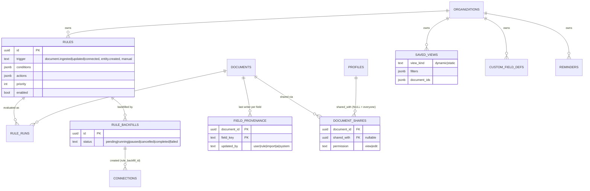
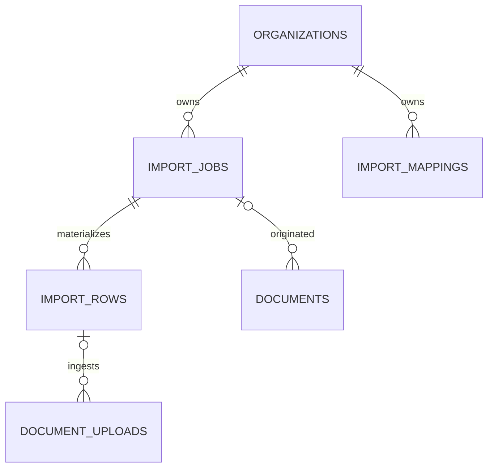

# Database

This is the full schema reference: every table, column, enum, function, and Storage bucket, plus
the migration history that produced them. For *why* a table or policy is shaped the way it is,
see [SECURITY.md](SECURITY.md) and the relevant section of [MODULES.md](MODULES.md) — this doc is
the "what exists" reference, not the "why" narrative.

All tables live in the `public` schema. `auth.users` is Supabase-managed and not listed as its own
entity below — `public.profiles.id` is a 1:1 foreign key to it (`on delete cascade`), and every
`user_id`/`owner_id`/`actor_id`/`created_by`/`invited_by`/`accepted_by` column elsewhere also
references `auth.users(id)` directly (not `profiles.id`), which is why the diagram below draws
those relationships from `PROFILES` — they're the same row.

## Entity-relationship diagram

```mermaid
erDiagram
  PROFILES {
    uuid id PK "= auth.users.id"
    text email
    text name
    text avatar_url
    text timezone "default 'UTC'"
    text locale "default 'en'"
    boolean onboarding_completed
    boolean is_app_admin
    timestamptz suspended_at
    timestamptz created_at
    timestamptz updated_at
  }

  ORGANIZATIONS {
    uuid id PK
    text name
    text slug UK
    text logo_url
    uuid created_by FK "auth.users, set null"
    timestamptz suspended_at
    text timezone "default 'Europe/Ljubljana' — Documenti"
    text locale "default 'sl-SI' — Documenti"
    char currency "default_currency, default 'EUR' — Documenti"
    text provisioning_status "pending|provisioning|ready|provisioning_failed, system-managed — Documenti"
    boolean ai_enabled "default false, system-managed — Documenti"
    timestamptz created_at
    timestamptz updated_at
  }

  ORGANIZATION_MEMBERS {
    uuid id PK
    uuid organization_id FK
    uuid user_id FK "auth.users, UNIQUE — one org per account, Documenti"
    organization_role role "owner | admin | member | read-only"
    timestamptz blocked_at "nullable — org-scoped block, Documenti"
    timestamptz created_at
    timestamptz updated_at
  }

  ORGANIZATION_INVITATIONS {
    uuid id PK
    uuid organization_id FK
    text email
    text invitee_name "nullable — prefills the invite-accept signup form, Documenti"
    organization_role role
    text token_hash UK
    uuid invited_by FK "auth.users, set null"
    uuid accepted_by FK "auth.users, set null"
    timestamptz accepted_at
    timestamptz revoked_at
    timestamptz expires_at
    timestamptz created_at
    timestamptz updated_at
  }

  STRIPE_CUSTOMERS {
    uuid id PK
    billing_owner_type owner_type "user | organization"
    uuid user_id FK "auth.users, nullable"
    uuid organization_id FK "nullable"
    text stripe_customer_id UK
    timestamptz created_at
    timestamptz updated_at
  }

  SUBSCRIPTIONS {
    uuid id PK
    billing_owner_type owner_type
    uuid user_id FK "auth.users, nullable"
    uuid organization_id FK "nullable"
    text stripe_customer_id
    text stripe_subscription_id UK
    text stripe_price_id
    text plan_key
    subscription_status status
    timestamptz current_period_start
    timestamptz current_period_end
    boolean cancel_at_period_end
    timestamptz platform_disabled_at "admin override, never set by Stripe"
    timestamptz created_at
    timestamptz updated_at
  }

  CREDIT_TRANSACTIONS {
    uuid id PK
    billing_owner_type owner_type
    uuid user_id FK "auth.users, nullable"
    uuid organization_id FK "nullable"
    integer amount "not 0; ledger entry, never mutated"
    credit_transaction_type type
    text reference
    jsonb metadata
    uuid created_by FK "auth.users, set null"
    timestamptz created_at
  }

  USAGE_COUNTERS {
    uuid id PK
    billing_owner_type owner_type
    uuid user_id FK "auth.users, nullable"
    uuid organization_id FK "nullable"
    text feature
    text period "'lifetime' | YYYY-MM-DD | YYYY-MM"
    integer quantity
    timestamptz reset_at
    timestamptz created_at
    timestamptz updated_at
  }

  NOTIFICATIONS {
    uuid id PK
    uuid user_id FK "auth.users"
    text type
    text title
    text message
    jsonb metadata
    timestamptz read_at
    timestamptz created_at
  }

  AUDIT_LOGS {
    uuid id PK
    uuid actor_id FK "auth.users, set null, nullable = system-initiated"
    text actor_type "user|system|rule|import|ai, default 'user' — ADR-0005, Documenti"
    uuid organization_id FK "set null, nullable"
    text action "dot-namespaced, e.g. auth.login"
    text entity_type
    text entity_id
    jsonb metadata
    inet ip_address
    text user_agent
    timestamptz created_at
  }

  WEBHOOK_EVENTS {
    uuid id PK
    text provider "e.g. 'stripe'"
    text event_id
    text event_type
    webhook_processing_status status
    jsonb payload
    text error
    timestamptz processed_at
    timestamptz created_at
    timestamptz updated_at
  }

  TENANT_PAPERLESS_CONFIG {
    uuid organization_id PK "= organizations.id"
    text base_url
    int service_user_id "Paperless-side user id"
    int group_id "Paperless-side group id"
    bytea api_token_encrypted "AES-GCM, admin-client only, never in a client response"
    int storage_path_id "nullable"
    timestamptz last_reconciled_at
    timestamptz created_at
    timestamptz updated_at
  }

  PAPERLESS_OBJECT_MAP {
    bigint id PK
    uuid organization_id FK
    text object_type "document|tag|document_type|custom_field|correspondent|storage_path|workflow|saved_view"
    int paperless_id "unique together with object_type, without organization_id — deliberate"
    uuid local_id "nullable — our row, where one exists"
    timestamptz created_at
  }

  ENTITY_TYPES {
    uuid id PK
    uuid organization_id FK
    text key "e.g. 'customer' — unique with organization_id"
    text name
    text name_plural
    text icon "nullable"
    boolean is_system "true for the 4 seeded types"
    jsonb field_schema
    timestamptz created_at
    timestamptz updated_at
  }

  DOCUMENTS {
    uuid id PK
    uuid organization_id FK
    int paperless_document_id "unique with organization_id"
    text title
    text document_type_key "nullable"
    date document_date "nullable"
    text correspondent_name "nullable"
    int page_count "nullable"
    bigint byte_size "nullable"
    text mime_type "nullable"
    text checksum "nullable — Paperless's, for dedup"
    text status "pending|processing|ready|failed|orphaned"
    text source "upload|import|email|template"
    uuid import_job_id "nullable"
    timestamptz synced_at "nullable"
    uuid created_by FK "auth.users, set null"
    timestamptz created_at
    timestamptz updated_at
    timestamptz deleted_at "nullable — soft delete"
  }

  DOCUMENT_UPLOADS {
    uuid id PK
    uuid organization_id FK
    text storage_path
    text filename
    text declared_mime_type
    bigint size_bytes
    text status "pending|uploaded|validating|validated|submitting|processing|completed|failed|expired"
    text error_message "nullable"
    text paperless_task_id "nullable — resumable polling"
    uuid document_id FK "nullable, set once documents row exists"
    uuid created_by FK "auth.users, set null"
    timestamptz created_at
    timestamptz updated_at
    timestamptz expires_at
  }

  ENTITIES {
    uuid id PK
    uuid organization_id FK
    uuid entity_type_id FK
    text display_name
    text status "active|archived"
    jsonb data "per-entity-type field values, keyed by field_schema key"
    tsvector search_tsv "generated from display_name"
    uuid created_by FK "profiles, nullable"
    timestamptz created_at
    timestamptz updated_at
    timestamptz deleted_at "nullable — soft delete (merge target)"
  }

  ENTITY_IDENTIFIERS {
    uuid id PK
    uuid organization_id FK
    uuid entity_id FK
    text kind "e.g. 'vat', 'company_reg' — from field_schema's identifier_kind"
    text value "as entered"
    text normalized "unique with (organization_id, kind) — import matching key"
    timestamptz created_at
  }

  CONNECTIONS {
    uuid id PK
    uuid organization_id FK
    text source_kind "document|entity — polymorphic, no FK"
    uuid source_id "polymorphic, no FK by design"
    text target_kind "document|entity — polymorphic, no FK"
    uuid target_id "polymorphic, no FK by design"
    text relation "belongs_to|issued_to|assigned_to|part_of|related"
    jsonb metadata
    uuid created_by FK "profiles, nullable"
    text created_via "manual|rule|import|template|ai_accepted|bulk"
    uuid rule_id "nullable, no FK yet — Phase 4"
    timestamptz created_at
    timestamptz deleted_at "nullable — soft delete"
  }

  CUSTOM_FIELD_DEFS {
    uuid id PK
    uuid organization_id FK
    text key
    text label
    text data_type
    jsonb options "nullable — e.g. select choices"
    text applies_to_array "text[] — document|entity kinds this field applies to"
    int paperless_custom_field_id "nullable — mirror link, never queried live from Paperless"
    timestamptz created_at
    timestamptz updated_at
  }

  SAVED_VIEWS {
    uuid id PK
    uuid organization_id FK
    text name
    text scope "documents|entities"
    uuid entity_type_id FK "nullable"
    jsonb filters
    jsonb columns
    jsonb sort "nullable"
    boolean is_shared
    uuid created_by FK "profiles, nullable"
    timestamptz created_at
  }

  BACKGROUND_OPERATIONS {
    uuid id PK
    uuid organization_id FK
    text kind "bulk_connect|bulk_paperless_edit|export"
    text status "pending|processing|completed|failed"
    jsonb params
    int total_count "nullable"
    int processed_count
    int success_count
    int failure_count
    jsonb failures "per-item {id, error}[]"
    jsonb result "nullable — e.g. {connectionIds} or {storagePath, rowCount}"
    text error_message "nullable"
    uuid created_by FK "auth.users, set null"
    timestamptz created_at
    timestamptz updated_at
    timestamptz completed_at "nullable"
  }

  PROFILES ||--o{ ORGANIZATION_MEMBERS : "is a member via"
  ORGANIZATIONS ||--o{ DOCUMENTS : "has (Documenti)"
  ORGANIZATIONS ||--o{ DOCUMENT_UPLOADS : "has (Documenti)"
  DOCUMENTS ||--o{ DOCUMENT_UPLOADS : "resolved from (Documenti)"
  ORGANIZATIONS ||--o{ ENTITY_TYPES : "has (Documenti)"
  ORGANIZATIONS ||--o{ ENTITIES : "has (Documenti Level 1)"
  ENTITY_TYPES ||--o{ ENTITIES : "typed by (Documenti Level 1)"
  ENTITIES ||--o{ ENTITY_IDENTIFIERS : "has (Documenti Level 1)"
  ORGANIZATIONS ||--o{ CONNECTIONS : "has (Documenti Level 1, polymorphic source/target)"
  ORGANIZATIONS ||--o{ CUSTOM_FIELD_DEFS : "has (Documenti Level 1)"
  ORGANIZATIONS ||--o{ SAVED_VIEWS : "has (Documenti Level 1)"
  ENTITY_TYPES ||--o{ SAVED_VIEWS : "scopes (optional, Documenti Level 1)"
  ORGANIZATIONS ||--o{ BACKGROUND_OPERATIONS : "has (Documenti Level 1)"
  ORGANIZATIONS ||--|| TENANT_PAPERLESS_CONFIG : "has (Documenti)"
  ORGANIZATIONS ||--o{ PAPERLESS_OBJECT_MAP : "owns (Documenti)"
  ORGANIZATIONS ||--o{ ORGANIZATION_MEMBERS : "has"
  ORGANIZATIONS ||--o{ ORGANIZATION_INVITATIONS : "has"
  PROFILES ||--o{ ORGANIZATION_INVITATIONS : "invites / accepts"
  PROFILES ||--o{ STRIPE_CUSTOMERS : "owns (user mode)"
  ORGANIZATIONS ||--o{ STRIPE_CUSTOMERS : "owns (org mode)"
  PROFILES ||--o{ SUBSCRIPTIONS : "owns (user mode)"
  ORGANIZATIONS ||--o{ SUBSCRIPTIONS : "owns (org mode)"
  PROFILES ||--o{ CREDIT_TRANSACTIONS : "owns (user mode)"
  ORGANIZATIONS ||--o{ CREDIT_TRANSACTIONS : "owns (org mode)"
  PROFILES ||--o{ USAGE_COUNTERS : "owns (user mode)"
  ORGANIZATIONS ||--o{ USAGE_COUNTERS : "owns (org mode)"
  PROFILES ||--o{ NOTIFICATIONS : "receives"
  PROFILES ||--o{ AUDIT_LOGS : "acts (optional — null = system)"
  ORGANIZATIONS ||--o{ AUDIT_LOGS : "scopes (optional)"
```

`stripe_customers`, `subscriptions`, `credit_transactions`, and `usage_counters` all share the
same **owner-polymorphic** shape: `owner_type` plus exactly one of `user_id`/`organization_id` set
(enforced by a `check` constraint), never both. This is what lets one code path
(`src/modules/billing/owner.ts`'s `BillingOwner`) serve both "users pay individually" and
"organizations pay for their members" without duplicated tables or duplicated service logic — see
[ARCHITECTURE.md](ARCHITECTURE.md#owner-polymorphic-billing).

## Entity-relationship diagram — rules, sharing, views (added after Level 1 polish)

The main diagram above predates these tables. All are tenant-scoped (`organization_id` + index + RLS).

## Enums

| Enum | Values |
| --- | --- |
| `organization_role` | `owner`, `admin`, `member`, `read-only` (added for Documenti — a viewer role with read access identical to `member` but no write access, see `has_organization_write_access()` below) |
| `subscription_status` | `incomplete`, `trialing`, `active`, `past_due`, `canceled`, `unpaid`, `paused` |
| `credit_transaction_type` | `subscription_grant`, `purchase`, `usage`, `refund`, `admin_adjustment`, `promotion` |
| `billing_owner_type` | `user`, `organization` |
| `webhook_processing_status` | `pending`, `processed`, `failed` |

## Functions

All SECURITY DEFINER unless noted, and all `set search_path` explicitly (Postgres best practice
for SECURITY DEFINER functions — an unset search_path is a privilege-escalation vector).

| Function | Purpose |
| --- | --- |
| `set_updated_at()` | Trigger function — stamps `updated_at = now()` on update. Attached to most tables. |
| `handle_new_user()` | Trigger on `auth.users` insert — creates the matching `profiles` row on signup. |
| `is_app_admin()` | `true` if the current session's user has `profiles.is_app_admin = true` and isn't suspended. Used in nearly every RLS policy as the admin-bypass clause. |
| `is_organization_member(target_organization_id)` | `true` if the current session's user is a member of the org, the membership isn't blocked (`blocked_at is null`), **and** the org isn't suspended. The suspension check lives here, not in application code — see [SECURITY.md](SECURITY.md#admin). |
| `has_organization_role(target_organization_id, allowed_roles)` | Same as above, plus a role check. |
| `has_organization_write_access(target_organization_id)` | Same as `is_organization_member()` but excludes the `read-only` role and, since `20260929000000_admin_document_management_parity.sql`, also checks `blocked_at is null` directly (it runs its own query rather than calling `is_organization_member()`, so this was a real gap — a blocked member kept write access to documents until this was added) — Documenti. Use this, not `is_organization_member()`, for any org-scoped write policy that should be denied to a viewer (e.g. `document_uploads_insert_member`). |
| `block_member(p_member_id)` / `unblock_member(p_member_id)` | Owner/admin only, not on self or the owner. Sets/clears `organization_members.blocked_at` and writes the `organization.member.blocked`/`organization.member.unblocked` audit row atomically — Documenti, ADR-0008, ADR-0018. Reversible and preserves the member row/role, unlike `remove_member()`. |
| `protect_system_columns()` | Trigger function on `organizations` — rejects a non-`service_role` write to `provisioning_status` or `ai_enabled` (system-managed; set only by the tenant-provisioning job and the AI opt-in flow). RLS is row-level, not column-level, so this is the enforcement point — Documenti. |
| `create_organization(org_name, org_slug)` | Creates an org and the creator's `owner` membership in one transaction (the creator has no RLS access to insert their own membership otherwise — see [SECURITY.md](SECURITY.md#organizations)). Raises if the caller already belongs to any organization — one org per account, ADR-0018. |
| `get_organization_invitation(p_token)` | Looks up an invitation by its token hash, including `invitee_name` (used to prefill the accept-and-signup form) — the invitee isn't a member yet, so this can't be a plain RLS-scoped select. Signature changed (`invitee_name` added to the returned row) in `20260928010000_invitation_invitee_name.sql`, which had to `DROP FUNCTION` first — Postgres rejects `CREATE OR REPLACE` when the `OUT`-parameter row type changes. |
| `accept_organization_invitation(p_token)` | Validates the token (hash, expiry, revocation, email match) and inserts the membership atomically. Raises if the caller already belongs to any organization — defense in depth behind `organization_members_user_id_key`, ADR-0018. |
| `transfer_organization_ownership(p_org_id, p_new_owner_id)` | Swaps two members' roles (old owner → admin, new owner → owner) **and writes the `organization.ownership_transferred` audit row** in the same transaction — Documenti, ADR-0008; the audit insert was added after the fact (see `update_member_role` below for why). |
| `update_member_role(p_member_id, p_role)` | Replicates the `has_organization_role(owner\|admin)` check explicitly (bypasses RLS as SECURITY DEFINER), updates the role, writes the `organization.member.role_changed` audit row atomically — Documenti, ADR-0008. Added because a plain RLS-scoped update + a separate `logEvent()` call isn't a guaranteed audit record: `logEvent()`'s sinks are best-effort and never throw back into the caller. |
| `remove_member(p_member_id)` | Same auth check as `update_member_role`, deletes the member's `document_shares` rows and the member row, writes `organization.member.removed` atomically — Documenti, ADR-0008. |
| `can_manage_document(p_document_id)` | Caller is the document's creator, an org owner, **or an org admin** (extended from owner-only in `20260929000000_admin_document_management_parity.sql` — ADR-0017 amendment). SECURITY DEFINER; single source of truth for share/unshare/delete rights — Documenti, document sharing. |
| `can_edit_document(p_document_id)` | `has_organization_write_access` AND (manage — creator/owner/admin — OR an `edit` share for the caller). A read-only member never edits, even with an `edit` share. |
| `is_document_shared_with_me(p_document_id)` | Any (view or edit) share for the caller; used by the `documents_select_member` policy. SECURITY DEFINER so `documents` and `document_shares` policies don't recurse into each other. |
| `filter_document_ids(p_organization_id, p_ids, p_required)` | Subset of `p_ids` the caller can `edit` or `manage`; bulk edit/connect resolve their ids through it so every downstream write sees the identical set. |
| `share_document(p_document_id, p_user_id, p_permission)` | Creator/owner only; grantee must be a same-org member who doesn't already have full access; `edit` rejected for a read-only grantee; upserts the share and writes the `document.shared` audit row atomically — ADR-0008. |
| `unshare_document(p_document_id, p_user_id)` | Same auth as `share_document`; deletes the share and writes `document.unshared` atomically. |
| `get_document_permissions(p_document_id)` | One-call payload for the document Permissions tab (organization owner, creator, shares with names, and — for creator/owner/**admin** only — the shareable member list; extended to admin alongside `can_manage_document` above). SECURITY DEFINER because it reads other members' profiles; replicates the visibility check (member AND creator/owner/admin/shared) and raises `P0002` for a document the caller can't see. |
| `leave_organization(p_organization_id)` | Self-service leave, scoped to `auth.uid()`. Raises if the caller is the org's sole owner — replacing `organization_members_delete_self`'s RLS-policy-as-business-logic (a delete that RLS silently filtered to 0 rows for a sole owner) with an explicit exception, since this no longer goes through the caller's RLS-scoped client. Writes `organization.member.left` atomically — Documenti, ADR-0008. |
| `count_documents_by_creator(p_organization_id)` | Owner/admin only (raises otherwise). One aggregate `group by created_by` over `documents`, used by the team page's per-member doc-count column instead of pulling every document row over the client — Documenti, ADR-0018. |
| `increment_usage_counter(p_owner_type, p_user_id, p_organization_id, p_feature, p_period, p_amount, p_limit)` | Atomic conditional upsert — raises if the increment would exceed `p_limit`. The concurrency-safe alternative to a client-side read-then-write. |
| `consume_credits(p_owner_type, p_user_id, p_organization_id, p_amount, p_reference, p_metadata)` | Takes a per-owner Postgres advisory lock, sums the ledger, inserts a debit row if sufficient balance exists — serializes concurrent spends to prevent double-spending on a table with no mutable balance column. |
| `purge_old_audit_logs()` | Deletes `audit_logs` rows older than 2 years (ADR-0005 — extended from the original 30-day admin-only window once this table started also carrying Documenti's business audit). **Not scheduled anywhere yet** — see [SECURITY.md](SECURITY.md#audit-logs). |
| `claim_provisioning(p_organization_id)` | Conditional `UPDATE ... WHERE provisioning_status IN ('pending','provisioning_failed')`, returns whether *this* call claimed it. Not a Postgres advisory lock — see `provision-tenant.ts`'s doc comment for why a session-scoped lock isn't safe over PostgREST's pooled connections — Documenti. |
| `complete_provisioning(p_organization_id, p_base_url, p_service_user_id, p_group_id, p_api_token_encrypted, p_storage_path_id, p_object_map)` | Atomically writes `tenant_paperless_config`, `paperless_object_map` rows, the four system `entity_types`, `organizations.provisioning_status = 'ready'`, and the `org.provisioned` audit row — ADR-0008. Idempotent (`on conflict ... do nothing`/`do update`) — Documenti. |
| `fail_provisioning(p_organization_id, p_reason)` | Sets `provisioning_status = 'provisioning_failed'` and writes the `org.provisioning_failed` audit row atomically — Documenti. |
| `claim_upload_validation(p_upload_id, p_organization_id)` | Conditional `UPDATE ... WHERE status IN ('uploaded','validating')`, returns whether *this* call claimed it — Documenti, `worker/jobs/validate-upload.ts`. The `validating` arm (not just `uploaded`) exists so a BullMQ retry of the *same* job can reclaim its own prior attempt's row after a transient failure; without it, a retry landing after the row was already claimed would lose the claim race against itself and silently no-op. Unlike `claim_provisioning()`, explicitly rejects any caller whose `auth.role() <> 'service_role'` — `document_uploads` has no update RLS policy at all, so an unguarded SECURITY DEFINER function here would otherwise let any authenticated member flip another tenant's upload status via RPC. |
| `complete_upload_validation(p_upload_id, p_organization_id)` | Service-role-only (same guard as above), sets `status = 'validated'` — Documenti. |
| `fail_upload_validation(p_upload_id, p_organization_id, p_reason)` | Service-role-only, sets `status = 'failed'` + `error_message` — Documenti. |
| `merge_entities(p_keep_id, p_merge_id)` | **Documenti Level 1.** Re-points `connections`/`entity_identifiers` from the merged entity onto the kept one (dropping any that would collide with an existing row on the kept entity), soft-deletes the merged entity (`status = 'archived'`, `deleted_at = now()`), writes one `entity.merged` audit row — all atomically (ADR-0008). Checks `auth.uid()`/`has_organization_write_access()` itself (unlike the provisioning/upload trios, this one is meant to be called from a real request-context client, not the admin client — there is no worker-triggered merge path). Rejects self-merge, cross-org merge, and an unauthenticated/unauthorized caller by raising, not silently no-op'ing. |
| `claim_import_chunk(job_id, organization_id, limit)` | **Phase 3 milestone 1.** Service-role-only claim of up to 50 pending rows with `FOR UPDATE SKIP LOCKED`; changes a ready job to running and returns the claimed rows. Paused/terminal jobs claim nothing. |
| `complete_import_job(job_id, organization_id)` | Service-role-only conditional completion after no pending/processing rows remain; sets completed or completed_with_errors and writes the import-completion audit row atomically (ADR-0008). Returns false on a repeat or invalid transition. |
| `fail_import_job(job_id, organization_id, reason)` | Service-role-only conditional failure from nonterminal states; writes the failure audit row atomically and returns false on a repeat. |
| `bulk_update_import_rows(job_id, organization_id, rows jsonb)` | **Phase 3 milestone 5/6.** Service-role-only. One `UPDATE ... FROM jsonb_to_recordset(rows)` statement writing a different `status`/`result`/`error_code`/`error_message` per row — the batched-write primitive specs/06-importer.md's "batch the updates, don't hammer the DB at 10k rows" calls for, shared by `validateImportJob()`'s dry run and `run-import-chunk.ts`'s real execution. |
| `increment_import_job_progress(job_id, organization_id, processed_delta, succeeded_delta, failed_delta, skipped_delta)` | Service-role-only atomic increment (not read-modify-write) on `import_jobs`' four row counters — correct under the concurrent chunk chains a single job runs (`importsConfig.defaultConcurrencyPerOrganization`, default 4). |
| `list_documents_without_connections(organization_id, document_type_key, status, date_from, date_to, paperless_ids, cursor_created_at, cursor_id, limit)` | **Phase 3 milestone 7.** `security invoker` (not definer) — runs under the caller's own RLS same as a direct query. Replaces `listDocuments()`'s old "pull every connection row into memory, build a `NOT IN (...)` list" path with one indexed statement: the same filter set plus `NOT EXISTS` against `connections`, using that table's existing `(organization_id, source_kind, source_id)`/`(organization_id, target_kind, target_id)` partial indexes. Granted to `authenticated`, not just `service_role` — `listDocuments()` calls it under the caller's own RLS-scoped client. |

## Storage buckets

| Bucket | Visibility | Size limit | Used by |
| --- | --- | --- | --- |
| `avatars` | Public | 5 MB | `uploadAvatar()` — served via `getPublicUrl`, no signed URL needed |
| `org-logos` | Public | 5 MB | **Documenti, ADR-0018.** `uploadOrganizationLogo()` — same pattern as `avatars` (public, `getPublicUrl`, replaces the previous file on update), path-namespaced `{organizationId}/logo-*`. Replaces the old plain-text `logo_url` paste-a-URL field. |
| `document-uploads` | Private | 100 MB | `createUploadIntent()`/`completeUpload()` — Documenti. Direct-to-storage (`createSignedUploadUrl()`, fixed 2h expiry, not the server-buffered pattern the other bucket uses); no `storage.objects` RLS policies, the signed URL's own token is the authorization. |
| `exports` | Private | 100 MB | **Documenti Level 1.** `worker/jobs/export.ts` uploads the generated CSV/XLSX via the admin client; `GET /api/exports/[id]/download` issues a 5-minute signed URL and redirects — no `storage.objects` RLS policies, same convention as `document-uploads`. |
| `import-sources` | Private | 100 MB | **Phase 3 milestone 1.** Signed source uploads for CSV/TSV/XLSX/ZIP; bucket MIME restrictions and `src/config/imports.ts` define accepted types. Dashboard import routes and signed-upload Server Actions are implemented (M8). |

No `storage.objects` RLS policies exist for these private buckets — every read/write goes through the
service-role admin client from trusted server code. The boilerplate's private `files` bucket was
dropped along with the Files module — see
`supabase/migrations/20260913120000_drop_files_and_projects.sql`.

## Phase 3 import persistence (milestone 1)

`import_jobs` stores the source filename/key, kind, confirmed mapping/options, ten status
values, five row counters, error, actor, and start/finish timestamps. `total_rows` is limited
to 50,000. `import_rows` stores each numbered source row as JSON, its status, result/error,
attempt count, and processing timestamp. Its `processing` status is the claim checkpoint in
addition to the spec's listed terminal outcomes. `import_mappings` stores a named, reusable
mapping per organization and kind. Names are unique inside one organization.

The composite foreign keys from `import_rows` to `import_jobs`, from `documents.import_job_id`
to `import_jobs`, and from `document_uploads.import_row_id` to `import_rows` include
`organization_id`. This stops a worker or request bug from attaching a valid foreign-tenant ID
to a local row. `document_uploads.source_archive_key` records the source ZIP key for the shared
ingest path built in milestone 3. Import counters live on `import_jobs`; the
`background_operations` kind constraint is unchanged.

## Phase 3 importer runtime (milestone 2)

Queue runtime settings now live in `src/lib/queue/config.ts`. Ingest-related queues run at
`WORKER_INGEST_CONCURRENCY` (default 8), while reconciliation, sweeps, exports, and placeholder
jobs remain single-concurrency. `submit-upload-to-paperless` has a global BullMQ limiter
(`PAPERLESS_INGEST_RATE_PER_SECOND`) and default priority `1`; future import row jobs default
to priority `10`, so interactive uploads stay ahead of bulk import work when they share the
Paperless submission budget.

`src/lib/redis/index.ts` owns the shared Redis client used by BullMQ producers/workers and the
per-org token bucket in `src/lib/ratelimit/token-bucket.ts`. The token bucket enforces
`PAPERLESS_UPLOADS_PER_ORG_PER_MINUTE` and `PAPERLESS_READS_PER_ORG_PER_MINUTE` using one Lua
script. In workers, exhaustion delays the active BullMQ job instead of consuming a retry
attempt. The Paperless client also uses a bounded Undici agent and applies
`PAPERLESS_STREAM_TIMEOUT_MS` to stream requests.

## Phase 3 importer execution (milestones 5–7)

`import_rows.status='pending'` is the only status `claim_import_chunk()` claims — every plan
resolution function (`src/modules/imports/imports.matching.ts`) is shared verbatim between
`validateImportJob()`'s dry run and `run-import-chunk.ts`'s real execution, and executable plans stay pending until the real run. Validation may mark genuinely
invalid rows `failed`/`needs_review`; it must never mark an executable row `ok`/`skipped_duplicate`.
A genuine bug found by live verification, not by any unit test: an earlier version of
`validateImportJob()` wrote the plan's real terminal status during the dry run itself, which
silently starved every import — nothing was ever left `pending` for the real run to find. See
`docs/PHASE3_HANDOFF.md` for the full account.

`run-import-chunk.ts` is a self-perpetuating job chain, not a fixed worker pool: each chunk
re-enqueues itself on completion (checking the Redis control flag in `src/lib/import/control.ts`
first — `"paused"`/`"cancelled"` stop the chain instead of rescheduling), and
`startImportJob()` bounds per-org concurrency by starting exactly
`importsConfig.defaultConcurrencyPerOrganization` (default 4) initial chains. A brand-new
document (the `"documents"` kind, matched by archive filename) can't have its entity
links/custom-field writes applied at chunk-processing time — the document doesn't exist in our
`documents` mirror until `sync-paperless-document.ts` processes it, which happens on its own
async schedule after Paperless actually consumes the file. That row's resolved plan
(`pendingEntityLinks`/`pendingFieldWrites`) is persisted onto `import_rows.result` and applied
by a hook in `sync-paperless-document.ts` once the document lands — `documents.import_job_id`
and `.source='import'` are set in that same upsert. `src/modules/imports/imports.apply.ts` is
the one implementation of "apply this row's entity links"/"apply this row's field writes",
shared between the synchronous (documents/metadata_only matched to something that already
exists) and deferred (newly-created documents) paths, so the two can't quietly diverge.

## Phase 3 UI persistence (milestone 8)

No schema migration is needed. `import_jobs.options.analysis` holds the bounded column preview,
row count, encoding and delimiter. `options.validation` holds the dry-run summary; `unmatched`
when present is a subset of `failed`, not an additional error count. Mapping changes/reanalysis
invalidate the saved review. A failed validation returns to `mapping` for recovery.

Dry-run terminal failures initialize `processed_rows` and `failed_rows` before execution. The
worker adds only the rows it actually claims; retries subtract the failed rows' prior counter
contribution before re-queuing them. This preserves accurate final totals for partial imports.
Document/OCR progress is counted independently from `document_uploads`, joined to `import_rows`
by the existing composite tenant-safe FK. All status counts remain organization-scoped and
use the requesting user's RLS client.

## Phase 3 scale/isolation closeout (milestone 9)

No schema migration was needed. The runtime fix is in the shared planner: an entity link mapped
with `on_missing:"fail_row"` now becomes a terminal `ENTITY_NOT_FOUND` row during validation
instead of reaching execution as an "ok row with a failed link result"; `skip_connection`
remains executable but carries `needs_review` through validation and final execution status.
This is the importer-specific isolation test #11: tenant A cannot map to tenant B's identifier,
and no cross-tenant connection is created.

`scripts/loadtest-import.ts` is the reproducible scale harness. It creates a disposable org,
builds a ZIP with an XLSX manifest and N valid PDFs, uploads the source to `import-sources`,
then runs the real analyze/mapping/validate services. `--execute` starts the real worker-backed
chunk chain; the default validate-only mode intentionally avoids enqueuing thousands of
Paperless OCR tasks. Live M9 validation run: 10,000 manifest rows, 16.6s analyze, 27.0s
validate, 0 row errors.

## Tables reference

For full column details, read the ER diagram above — it lists every column with its type and any
notable default/constraint. This section adds what the diagram can't: RLS policies and indexes.

| Table | RLS policies | Notable indexes |
| --- | --- | --- |
| `profiles` | select: own row or `is_app_admin()`. update: own row only. **No insert/delete policy** — rows are created only by the `handle_new_user()` trigger. | `profiles_email_idx` |
| `organizations` | select: member or admin. insert: `created_by = auth.uid()`. update: owner/admin or admin. delete: owner or admin. | unique on `slug` |
| `organization_members` | select/insert/update: owner/admin of the org, or admin. delete: self (unless sole owner) or owner/admin. | unique `(user_id)` — one org per account, ADR-0018 (was a plain index); `(organization_id)` |
| `organization_invitations` | select/all: owner/admin of the org, or admin. | `(email)` |
| `stripe_customers` | select only (owner or admin) — **no insert/update policy**, admin client only. | — |
| `subscriptions` | select only (owner or admin) — **no insert/update policy**, admin client only. | `(user_id)`, `(organization_id)` |
| `credit_transactions` | select only (owner or admin) — **no insert policy**, admin client only. | `(user_id)`, `(organization_id)` |
| `usage_counters` | select only (owner or admin) — **no insert/update policy**, admin client only. | partial unique `(owner_type,user_id,feature,period) where organization_id is null`; partial unique `(owner_type,organization_id,feature,period) where user_id is null` |
| `notifications` | select-own, update-own — **no insert policy**, admin client only. | `notifications_user_created_idx (user_id, created_at desc)` |
| `audit_logs` | select: admin, or org owner/admin for their own org's rows. **No insert policy at all** — `logEvent()`'s `auditLogSink` (admin client) is the only writer. | `audit_logs_actor_idx (actor_id, created_at desc)` |
| `webhook_events` | No policies read in application code (admin-client only, used solely by the Stripe webhook handler for idempotency). | unique `(provider, event_id)` |
| `tenant_paperless_config` | RLS enabled, **no policies** (admin-client only — `api_token_encrypted` must never reach a browser). Read/written only by `worker/jobs/provision-tenant.ts` and `src/lib/paperless/client.ts` — Documenti. | PK is `organization_id` itself (1:1) |
| `paperless_object_map` | RLS enabled, **no policies** (admin-client only). Read by the event-bridge webhook and reconciliation sweep to resolve a Paperless object to its tenant — Documenti. | unique `(object_type, paperless_id)` — deliberately without `organization_id`, so a cross-tenant mapping bug is a DB error, not a silent leak; `(organization_id, object_type)` |
| `entity_types` | select: org member or admin. write (insert/update/delete): org member **with write access** or admin — `has_organization_write_access()`, so `read-only` can't create/edit entity types either. Seeded (4 system rows per org) by `complete_provisioning()`, not application code — Documenti. | `(organization_id)` |
| `documents` | select: **creator, org owner/admin, or a share recipient** (`documents_select_member`, [ADR-0017](adr/0017-per-document-visibility-and-sharing.md), admin added by its amendment), or admin. **No insert/update/delete policy** — only the sync worker (admin client, `worker/jobs/sync-paperless-document.ts`) writes this table — Documenti. | `(organization_id, document_type_key)`, `(organization_id, document_date desc)`, `(organization_id, checksum)`, all `where deleted_at is null` (first three); **Phase 3 M7**: `(organization_id, created_at desc, id desc) where deleted_at is null` (backs `listDocuments()`'s keyset cursor — previously unindexed) and `(organization_id, status, created_at desc) where deleted_at is null` (every saved view except "All documents" filters by status) |
| `document_uploads` | select: org member or admin. insert: creator **with write access** (`created_by = auth.uid() and has_organization_write_access()`). **No update/delete policy** — every status transition after the initial insert runs via the admin client from a worker job — Documenti. | `(organization_id, created_at desc)`; partial `(expires_at) where status in ('pending','uploaded')` for `expire-abandoned-uploads.ts`'s sweep |
| `entities` | select: org member or admin. write (all): write-access member or admin — `has_organization_write_access()`. | `(organization_id, entity_type_id) where deleted_at is null`; GIN on `search_tsv`; GIN `jsonb_path_ops` on `data` |
| `entity_identifiers` | select: org member or admin. write (all): write-access member or admin. | `(organization_id, normalized)`; `(entity_id)`; unique `(organization_id, kind, normalized)` |
| `connections` | select: org member or admin. write (all): write-access member or admin. Application-level guard (not RLS, since `source_id`/`target_id` are polymorphic with no FK): `connections.service.ts#createConnection()`'s `assertBelongsToOrg()` rejects a source/target id that doesn't resolve to a row in the caller's own org — this closed isolation test #9 (a cross-org connection could otherwise be created silently). | unique `connections_unique_pair` on `(organization_id, least(source_id,target_id), greatest(source_id,target_id), relation) where deleted_at is null` — makes a duplicate connection a DB-level impossibility regardless of which side is passed first |
| `custom_field_defs` | select: org member or admin. write (all): write-access member or admin. Application-level guard: `custom-field-defs.service.ts` is the only code path allowed to read/write this table — product code must never call Paperless's `GET /api/custom_fields/` directly (confirmed cross-tenant leak, `docs/spike-findings.md` §1 #6). | `(organization_id)` |
| `saved_views` | select: org member or admin (shared views or the creator's own). write: creator or admin. `view_kind` `dynamic` (filters) or `static` (`document_ids`). | `(organization_id)` |
| `background_operations` | select: org member or admin. insert: creator **with write access**. **No update/delete policy** — every progress/status update after the initial insert runs via the admin client from a worker job (`worker/jobs/bulk-action.ts`, `worker/jobs/export.ts`) — same convention as `document_uploads`. | `(organization_id, created_at desc)` |
| `document_shares` | select: the recipient, a user who can manage the document, or admin. **No insert/update/delete policy** — writes only through `share_document()`/`unshare_document()` (audit row in the same transaction, ADR-0008). `shared_with` NULL means everyone in the org; permission `view` or `edit`. | `(organization_id)`, `(shared_with, organization_id)`, `(document_id)`, unique per person and unique for the everyone row |
| `rules` | select: org member or admin. write (all): write-access member or admin. `delegate_to_paperless`/`paperless_workflow_id` exist but stay unused (ADR-0006). | `(organization_id, trigger, priority)` |
| `rule_runs` | select: org member or admin. **No write policy** — written by `apply_rule_action()` and the worker (service role). | `(organization_id, rule_id, created_at desc)`, `(organization_id, document_id, created_at desc) where document_id is not null` |
| `rule_backfills` | select: org member or admin. insert: creator with write access, status `pending` only. Status/counters are worker-managed. Undo scope per ADR-0010. | `(organization_id, rule_id)` |
| `field_provenance` | select: org member or admin. Written by rule/user/import paths; PK `(document_id, field_key)`; `updated_by` in user/rule/import/ai/system. Reused by Level 2. | `(organization_id)` |
| `reminders` | select: org member or admin. Fired by `fire-due-reminders`. | `(due_date) where fired_at is null`, `(organization_id)` |
| `import_jobs` | select: org member or admin. insert: creator with write access, draft only. No user update/delete policy; worker transitions are service-role-only. | `(organization_id, created_at desc)`, `(organization_id, status)`; unique `(id, organization_id)` for same-tenant composite FKs |
| `import_rows` | select: org member or admin. Worker materializes/mutates rows via service role; no user write policy. | `(import_job_id, status)`, `(organization_id, import_job_id)`; unique `(import_job_id, row_number)` and `(id, organization_id)` |
| `import_mappings` | select: org member or admin. write: org member with write access or admin. | unique `(organization_id, name)`; `(organization_id, created_at desc)` |

## Migration history

Applied in filename order (timestamp-prefixed) via the Supabase CLI — see
[SETUP.md](SETUP.md#supabase).

| Migration | What it does |
| --- | --- |
| `20260813180000_initial_schema.sql` | All enums, all tables, all indexes, `set_updated_at()` + triggers, `is_app_admin()`/`is_organization_member()`/`has_organization_role()`, full RLS policy set, `handle_new_user()` trigger on `auth.users`. |
| `20260820120000_organizations_functions.sql` | `create_organization`, `get_organization_invitation`, `accept_organization_invitation`, `transfer_organization_ownership`; adds the `organization_members_delete_self` policy (leave-org, blocked for a sole owner). |
| `20260820121500_organizations_delete_policy.sql` | Adds the missing `organizations` delete policy (owner or admin). |
| `20260821130000_billing_functions.sql` | Replaces `usage_counters`' original composite unique constraint with two partial unique indexes (nullable owner columns aren't equal to each other in Postgres, so the naive constraint didn't work); adds `increment_usage_counter` and `consume_credits`. |
| `20260822090000_files_storage.sql` | Creates the `avatars` and `files` Storage buckets; adds the two cursor-pagination indexes on `files`. |
| `20260823090000_admin.sql` | Adds `organizations.suspended_at` and threads it through `is_organization_member`/`has_organization_role`; adds `subscriptions.platform_disabled_at`; adds `purge_old_audit_logs()`. |
| `20260824000000_documenti_orgs_extension.sql` | **Documenti Level 0.** Adds `organizations.timezone`/`locale`/`default_currency`/`provisioning_status`/`ai_enabled`; adds the `read-only` value to `organization_role`; adds `protect_system_columns()` + its trigger (blocks non-service-role writes to `provisioning_status`/`ai_enabled`). Originally also added `has_organization_write_access()` in the same file, but Postgres forbids using a newly-added enum value (`read-only`) inside a function body compiled within the same transaction that added it (`SQLSTATE 55P04`) — split into the next migration once this was actually run against a real Postgres instance for the first time. |
| `20260824120000_documenti_write_access_function.sql` | **Documenti Level 0.** Adds `has_organization_write_access()` and repoints `files_insert_owner` at it so a `read-only` member can't upload files — split out of the previous migration for the enum-transaction reason above. |
| `20260825000000_paperless_linkage.sql` | **Documenti Level 0.** Adds `tenant_paperless_config` and `paperless_object_map` — both RLS-enabled with zero policies (admin-client only), matching the existing `stripe_customers`/`subscriptions`/`webhook_events` convention. Verified end-to-end against a throwaway Postgres container: RLS enabled + 0 policies confirmed, the `(object_type, paperless_id)` unique constraint correctly rejects a cross-tenant duplicate mapping, and the `object_type` check constraint correctly rejects an invalid value. |
| `20260826000000_tenant_provisioning.sql` | **Documenti Level 0/1.** Adds `entity_types` (RLS: member read, write-access write); adds `audit_logs.actor_type` (ADR-0005); adds `claim_provisioning()`/`complete_provisioning()`/`fail_provisioning()` (ADR-0008). Verified against a throwaway Postgres container: first claim succeeds and a concurrent second claim is correctly refused, retry-after-failure is re-claimable, `complete_provisioning()` is idempotent on re-run (still exactly 4 `entity_types` rows, no duplicates). |
| `20260827000000_audit_log_retention.sql` | **Documenti.** Extends `purge_old_audit_logs()`'s window from 30 days to 2 years (ADR-0005's stated consequence, not applied when `actor_type` was added). |
| `20260828000000_document_uploads.sql` | **Documenti Level 0.** Adds the `documents` mirror table (specs/02-data-model.md; select-only RLS) and `document_uploads` (specs/01-architecture.md §Upload; select + creator-insert RLS); creates the `document-uploads` Storage bucket. Verified against a throwaway Postgres container **as a real non-superuser role** (not just `psql -U postgres`, which bypasses RLS entirely) — a `member` can insert their own upload, a `read-only` member is correctly rejected by the RLS policy itself, not just by `has_organization_write_access()`'s own return value. |
| `20260912125436_document_upload_validation_functions.sql` | **Documenti Level 0.** Adds `claim_upload_validation()`/`complete_upload_validation()`/`fail_upload_validation()` for `worker/jobs/validate-upload.ts`, following the provisioning trio's claim/complete/fail pattern but explicitly service-role-only (see the Functions table above for why). First migration this session pushed to the real, live Supabase Cloud project rather than a throwaway container — see the previous two `documenti_orgs_extension`/`documenti_write_access_function` rows for the bug that surfaced doing so. |
| `20260912195634_transactional_membership_audit.sql` | **Documenti.** Adds `update_member_role()`, `remove_member()`, `leave_organization()`, and augments `transfer_organization_ownership()` so organization permission-change audit rows are written in the same transaction as the mutation (ADR-0008) — see the Functions table above. Verified live: each function called unauthenticated against the real project correctly raises `P0001: Authentication required` from inside the right function body (not a generic SQL error), confirming argument types and column references resolve correctly. |
| `20260922000000_document_visibility_rls.sql` | **Documenti.** `documents_select_member` / `document_uploads_select_member` limited to the creator, the org owner and app admins (previously any org member). |
| `20260923000000_document_shares.sql` | **Documenti.** `document_shares` table (no direct write policies), the permission functions above, `share_document`/`unshare_document`, `documents_select_member` extended with shares, and `remove_member`/`leave_organization` now delete the leaving member's shares. |
| `20260924000000_document_shares_everyone.sql` | **Documenti.** `document_shares.shared_with` nullable — a NULL row is an organization-wide grant (read-only members still never edit); `share_document`/`unshare_document` accept a NULL user; `can_edit_document`, `is_document_shared_with_me` and the shares select policy honor it. |
| `20260925000000_get_document_permissions.sql` | **Documenti.** `get_document_permissions()` — replaces ~10 separate queries behind the Permissions tab with one round trip. |
| `20260913061540_relax_upload_claim_for_retries.sql` | **Documenti.** Widens `claim_upload_validation()`'s claimable source statuses from `uploaded` only to `uploaded` or `validating` — a bug enabling BullMQ retries surfaced live: a same-job retry landing after a transient failure left the row at `validating`, and the claim could never re-match it, permanently stranding the upload with no error. |
| `20260913120000_drop_files_and_projects.sql` | **Documenti Level 1.** Drops the boilerplate's `files` and `projects` tables (with their policies/indexes) and the `files` Storage bucket entirely — neither is part of the product; Documents/Paperless and the `project` entity type supersede them. `has_organization_write_access()` is kept (load-bearing elsewhere by now). Avatar upload was extracted out of the files module first — see `src/modules/profile/avatar.service.ts`. |
| `20260914000000_entities_connections_fields_views.sql` | **Documenti Level 1.** Adds `entities`, `entity_identifiers`, `connections` (with `connections_unique_pair`), `custom_field_defs`, `saved_views`, and `merge_entities()`. Verified against a throwaway Postgres container: all migrations apply cleanly in order; the three unique constraints correctly reject duplicates; `merge_entities()` moves identifiers/connections, archives the merged entity, writes one audit row, and rejects unauthenticated/cross-org/self-merge calls; RLS itself (as a real non-superuser role) blocks a cross-tenant read and write. |
| `20260914120000_background_operations.sql` | **Documenti Level 1 (Milestone 7).** Adds `background_operations` (progress tracking for bulk actions + export, mirroring `document_uploads`'s select+creator-insert-only RLS shape) and creates the `exports` Storage bucket. |
| `20260915112736_phase3_import_foundation.sql` | **Phase 3 milestone 1.** Adds `import_jobs`/`import_rows`/`import_mappings` with RLS and indexes, tenant-safe composite FKs from `documents`/`document_uploads`, service-role-only claim/completion/failure RPCs, atomic audit, and the private `import-sources` bucket. Pushed to the live Supabase Cloud project. |
| `20260914120500_connections_created_via_bulk.sql` | **Documenti Level 1 (Milestone 7).** Widens `connections.created_via`'s check constraint to allow `'bulk'`, so a 500-document bulk-connect is tagged distinctly from 500 individual manual clicks in history/audit. |
| `20260916090000_import_bulk_write_functions.sql` | **Phase 3 milestones 5/6.** Adds `bulk_update_import_rows()` and `increment_import_job_progress()` — see the Functions table above. Verified live: called directly against the real project, correctly rejects a non-service-role caller and applies a real batched update/increment. |
| `20260916140000_documents_query_perf.sql` | **Phase 3 milestone 7.** Adds `(organization_id, created_at desc, id desc)` and `(organization_id, status, created_at desc)` indexes on `documents` (both `where deleted_at is null`), and `list_documents_without_connections()` — see the Functions table above. Verified live against the real project: the RPC returns correct results scoped to a real org. |
| `20260916150000_documents_sort_indexes.sql` | **Documenti Level 1.** Keyset-pagination composite indexes for sorting the documents list by title and document type. |
| `20260916170000_documents_listing_controls_created_at.sql` | **Documenti Level 1.** Listing-control support for the configurable columns/sorting on `created_at`. |
| `20260917120000_documents_numbered_pagination_rpc.sql` | **Documenti Level 1.** RPCs behind numbered pagination and the "no connections" filter (`count_document_connections`, `count_documents_without_connections`). |
| `20260918000000_rules_engine.sql` | **Documenti Level 1 (Phase 4).** `rules`, `rule_runs`, `rule_backfills`, `field_provenance`, `reminders`; `connections.rule_backfill_id`; `apply_rule_action()` (audit atomic with the mutation, ADR-0008). |
| `20260919000000_apply_rule_action_ownership_check.sql` | **Documenti Level 1.** `apply_rule_action()` rejects a source/target that is not in the caller's org (isolation test #10, defence in depth). |
| `20260920000000_fix_apply_rule_action_null_field_key.sql` | **Documenti Level 1.** Fix: `add_tag`/`remove_tag` have no field key and violated `field_provenance.field_key NOT NULL`. |
| `20260920010000_fix_rule_backfill_audit_actor_type.sql` | **Documenti Level 1.** Fix: `complete_rule_backfill()`/`fail_rule_backfill()` wrote an `audit_logs.actor_type` value the check constraint did not allow. |
| `20260920120000_saved_view_static_document_sets.sql` | **Documenti Level 1.** `saved_views.view_kind` (`dynamic`/`static`) and `saved_views.document_ids` jsonb. |
| `20260921000000_dashboard_stats_rpc.sql` | **Documenti Level 1.** `get_org_dashboard_counts()`, `get_member_dashboard_counts()` and their `created_by` partial indexes. |
| `20260926000000_preserve_document_creator.sql` | **Documenti.** Repairs `documents.created_by` nulled by re-syncs and adds the `preserve_document_creator()` trigger so no writer can null or reassign it. |
| `20260927000000_document_shares_organization_index.sql` | **Documenti.** Adds the missing leading `organization_id` index on `document_shares` (also folded into `20260923000000` for fresh databases). Caught by `scripts/check-rls-coverage.ts`. |
| `20260928000000_one_org_per_account_and_blocking.sql` | **Documenti, ADR-0018.** Adds `organization_members.blocked_at` and the unique `(user_id)` constraint (with a defensive dedupe of any pre-existing multi-org rows, keeping each user's earliest membership, before the constraint is added); extends `is_organization_member()`/`has_organization_role()` with `blocked_at is null`; adds `block_member()`/`unblock_member()`; `accept_organization_invitation()`/`create_organization()` now raise if the caller already belongs to an organization. |
| `20260928010000_invitation_invitee_name.sql` | **Documenti, ADR-0018.** Adds `organization_invitations.invitee_name`; `get_organization_invitation()` redefined (via `DROP FUNCTION` + `CREATE FUNCTION` — its `OUT` row type changed) to return it. |
| `20260928020000_org_logos_storage.sql` | **Documenti, ADR-0018.** Creates the `org-logos` Storage bucket — see the Storage buckets table above. |
| `20260928030000_documents_by_creator_rpc.sql` | **Documenti, ADR-0018.** Adds `count_documents_by_creator()` — see the Functions table above. |
| `20260929000000_admin_document_management_parity.sql` | **Documenti, ADR-0017 amendment.** Extends `documents_select_member`, `document_uploads_select_member`, `can_manage_document()`, `can_edit_document()`, `get_document_permissions()` from owner-only to owner-or-admin; also fixes `has_organization_write_access()` to check `blocked_at is null` (see the Functions table above). |

To add a new migration, create a new `supabase/migrations/<timestamp>_<name>.sql` file with a
timestamp later than the last one, and apply it the same way as the existing ones (see
[SETUP.md](SETUP.md#supabase)).
